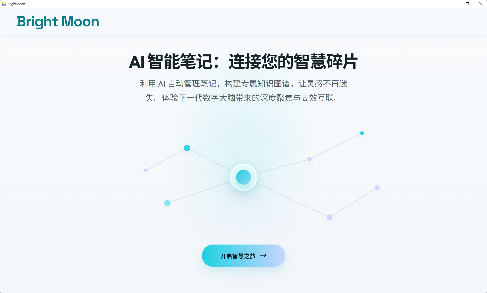
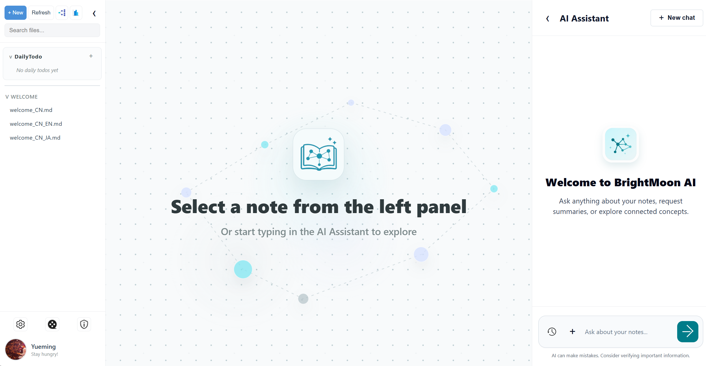

# BrightMoon V3.0   `README`
-`BrightMoon V3.0` is a local-first AI knowledge workspace for Markdown notes, knowledge graphs, Todo management, and agent-driven workflows.

It combines a Flask backend, a vanilla HTML/CSS/JavaScript frontend, local Markdown storage, local pickle-based knowledge graph files, and a tool/skill-based AI Assistant.

## Released URL
> Current project released at Github: [BrightMoon V3.0](https://github.com/TYueMing/BrightMoon/releases/tag/v3.0)

---
## Quick Start
### 1. Download and unzip
### 2. Run BrightMoon.exe
### 3. Configure the LLM in the setting page
---


---


## Features

- **Markdown note workspace**
  - Manage notes by folder under `RawNotes/`.
  - Create, edit, rename, move, and delete notes and folders.
  - Preview Markdown with a split editor and live preview.
  - Upload media into `RawFiles/` and embed it in notes.
  - Keep local version history under `RawNotesKG/_state/note_versions/`.

- **Knowledge graph**
  - Generate note-level triples from note content.
  - Review proposed KG diffs before applying them.
  - Add, update, confirm, mark stale, or delete triples.
  - View cross-note knowledge graphs by folder.
  - Search triples and inspect graph neighbors through Agent tools.

- **AI Assistant**
  - Streams reasoning and final answers in the right-side chat panel.
  - Stores completed chat sessions under `MoonAgent/Memory/DailyHistory/`.
  - Can use current note context while answering.
  - Supports document attachment from the chat input. Uploaded documents are copied to `RawFiles/`.

- **Agent tool system**
  - Planner/reflection loop for multi-step tasks.
  - Tool registry with JSON Schema-style input validation.
  - Permission-aware execution for write/delete operations.
  - Tool implementations are separated into `MoonAgent/Tools/Tool_Scripts/Tool.py`.
  - Additional tool modules can be discovered from `MoonAgent/Tools/` and `MoonAgent/Tools/Tool_Scripts/`.

- **Skill system**
  - Skills are stored as `SKILL.md` files under `MoonAgent/Skills/`.
  - Skill frontmatter declares metadata, triggers, aliases, and allowed tools.
  - The Agent matches user requests to skills, loads the skill instructions, and applies skill-level tool permission gates.

- **DailyTodo system**
  - A protected `RawNotes/DailyTodo/` folder stores date-based Todo files.
  - Todo files use Markdown checklist-like lines.
  - The left sidebar displays Todo completion status and progress.
  - Todo reminders and managed Todo items are available from the UI.
  - Agent tools can list, create, update, move, delete, and summarize Todo items.

- **Workspace analysis**
  - Analysis tab summarizes notes, folders, Todo completion, overdue items, KG coverage, and recent note activity.
  - Data is computed from local workspace files.
 
## Project Structure
```text
BrightMoon/
|-- main.py                         # Flask app, API routes, workspace services
|-- UI/
|   |-- templates/
|   |   |-- index.html              # Main workspace UI
|   |   `-- welcome.html            # Welcome page
|   `-- static/
|       |-- app.js                  # Frontend state, editor, chat, KG, analysis
|       `-- style.css               # Application styles
|-- MoonAgent/
|   |-- Agent.py                    # Planner / executor / reflector loop
|   |-- BuildContext/               # Prompt context and task-chain rules
|   |-- AgentUtils/                 # Agent helper functions
|   |-- Tools/
|   |   |-- run_tools.py            # Tool registry, schema validation, dispatcher
|   |   `-- Tool_Scripts/
|   |       `-- Tool.py             # Built-in tool implementations
|   |-- Skills/
|   |   |-- skill_manager.py        # Skill registry, matcher, loader
|   |   `-- */SKILL.md              # Individual skill definitions
|   `-- Memory/
|       `-- DailyHistory/           # Local chat history
|-- KG/
|   |-- KG.py                       # KnowledgeGraph persistence and triple helpers
|   `-- Cross_note_KG/              # Folder-level cross-note KG pickle files
|-- RawNotes/                       # Markdown note database
|-- RawFiles/                       # Uploaded/imported source files and media
|-- RawNotesKG/                     # Note-level KG files and app state
|-- img_asset/                      # UI icons and images
|-- profile/                        # User profile and LLM config
`-- utils/
    `-- call_llm.py                 # LLM client wrapper
```
---
## Unfortunately, CodeX mistakenly deleted all the project source code, so this is the only released version available.
---
